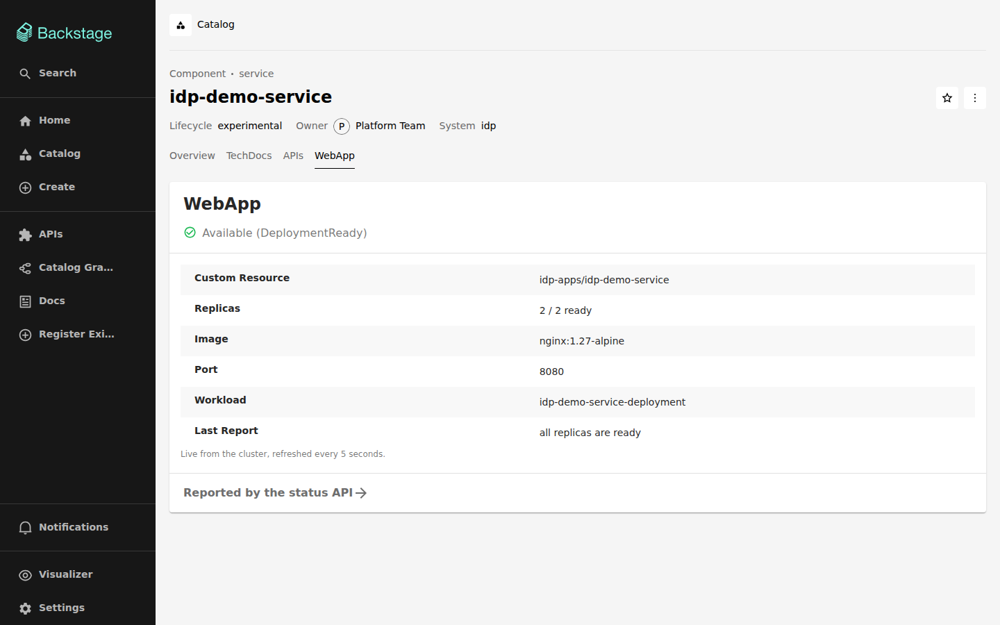
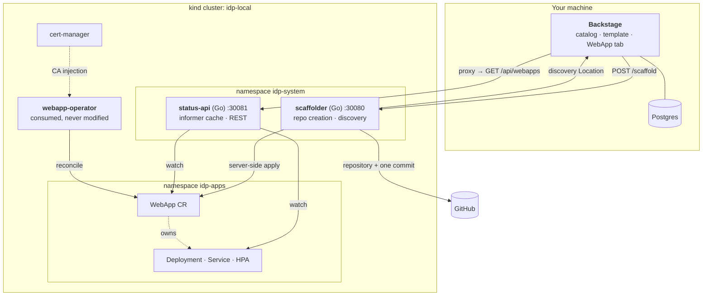

# Internal Developer Platform

[](https://github.com/Mampiz/idp-backstage/actions/workflows/go.yml)
[](https://github.com/Mampiz/idp-backstage/actions/workflows/backstage.yml)
[](https://github.com/Mampiz/idp-backstage/actions/workflows/e2e.yml)
[](LICENSE)

**Create a service from a form and it is running in Kubernetes before you finish
reading the confirmation page.** One step produces a GitHub repository with CI, a
container build and health endpoints, *and* a live workload — no manifest to
copy, no second tool, no ticket to the platform team.


Everything in that recording is real: a repository is created, a custom resource
is applied, pods start, and the last few seconds are somebody running
`kubectl scale` from a terminal while the page follows along.

## What you get

Filling in the template produces:

- **A repository** — a Go service with `/healthz`, `/readyz` and `/metrics`, a
  distroless container build, a Makefile, a GitHub Actions workflow publishing to
  ghcr.io, its own documentation, and the `webapp.yaml` describing how it runs.
- **A running workload** — a `WebApp` custom resource that
  [webapp-operator](https://github.com/Mampiz/webapp-operator) reconciles into a
  Deployment, a Service and, on request, a HorizontalPodAutoscaler.
- **A catalog entry** with a tab showing the live state of the cluster.



## Quick start

```bash
# The workflow scope is required: scaffolded repositories contain a GitHub
# Actions workflow, and GitHub refuses to write one without it.
unset GITHUB_TOKEN
gh auth refresh -h github.com -s workflow
export GITHUB_TOKEN=$(gh auth token)   # never written to disk

cp .env.example .env
make bootstrap    # kind cluster + cert-manager + webapp-operator (~75s)
make verify-f0    # prove that much works
make dev          # Postgres, both Go services, Backstage
```

Backstage comes up on <http://localhost:3000>. Full instructions in
[Getting started](docs/getting-started.md); `make help` lists every target.

## How it works



Backstage core is TypeScript and that cannot be avoided. Everything else is Go:
if a piece of logic can live in a Go service, it lives in a Go service, and the
TypeScript side is only ever an HTTP client to it. Validation, ordering,
idempotency and failure handling are things you want to be able to run `go test`
on — so the only TypeScript in the provisioning path is about seventy lines that
build a request and turn status codes into readable messages.

## Documentation

| | |
|---|---|
| [Getting started](docs/getting-started.md) | Run the whole platform locally |
| [Creating a service](docs/creating-a-service.md) | The form, the repository, changing what runs |
| [Architecture](docs/architecture.md) | The components and why each exists |
| [Troubleshooting](docs/troubleshooting.md) | The failures you will actually hit |
| [Design decisions](docs/decisions.md) | The choices that were not obvious |
| [Contributing](CONTRIBUTING.md) | Layout, tests, CI |

The same documentation is served as TechDocs inside the portal.

## A note on failure

If the repository is created and the custom resource cannot be applied, **nothing
is deleted**. Rolling back would mean deleting a GitHub repository that might not
have been ours to delete. Instead the repository is tagged
`idp-provisioning-incomplete`, the API answers `207` naming the step that failed,
and re-sending the same request finishes the job, because every step is
idempotent.

That trade-off is deliberate: an abandoned failed run leaves a repository behind,
which is a price worth paying to never destroy something we did not create.

## License

[Apache 2.0](LICENSE).
