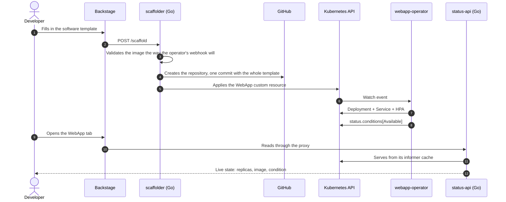
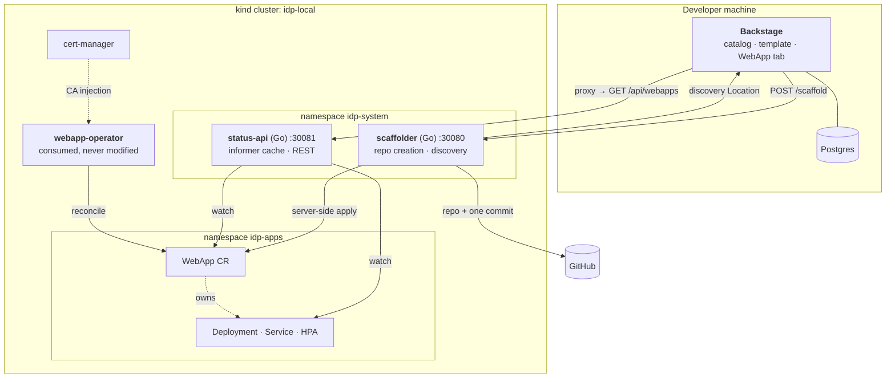

# idp-backstage

**Filling in one form produces a GitHub repository and a running workload in
Kubernetes.** No copy-pasted manifest, no second tool, no ticket to the platform
team.

The piece that makes it possible is a Kubernetes operator I wrote,
[webapp-operator](https://github.com/Mampiz/webapp-operator): it reconciles a
`WebApp` custom resource into a Deployment, a Service and an optional
HorizontalPodAutoscaler. This repository is what turns that operator into a
self-service product.


*One form. A repository, a `WebApp` custom resource, running pods, and a tab
that follows the cluster — the last few seconds are a `kubectl scale` happening
outside Backstage entirely.*

---

## What this demonstrates

**That a platform is a product, not a pile of YAML.** The developer-facing
surface is one form with six fields. Everything behind it — validating the image
against what admission will accept, creating the repository, applying the custom
resource, deciding what happens when half of that succeeds — is a service with
tests, not a template with `if` statements.

**That "done" means a command exits zero.** Six phases, six verifiers. Each one
asserts against the cluster rather than against itself: the status API's numbers
are compared field by field with `kubectl`'s, and the frontend is checked by a
real browser that watches the page follow a `kubectl scale`. Several include
negative assertions — F0 fails if a `WebApp` with a `:latest` image is *accepted*,
because a green run against broken admission webhooks is the failure that is
hardest to notice.

**That failure states are designed, not discovered.** If the repository is created
and the custom resource cannot be applied, nothing is deleted: the repository is
tagged `idp-provisioning-incomplete`, the API answers `207` naming the step that
failed, and re-sending the same request finishes the job. Rolling back would mean
deleting a GitHub repository we might not have created.

**That consuming somebody else's operator means reading it first.** Three things
in the operator shaped this platform before a line of it was written: its
`dist/install.yaml` needs cert-manager and does not say so; its ClusterRole is
missing a rule for `events`, so every event it emits is silently rejected; and its
validating webhook rejects `:latest` — which its own shipped sample uses.

**That knowing where logic belongs is the skill.** Backstage core is TypeScript
and that cannot be avoided. Everything else is Go. The only TypeScript in the
provisioning path is seventy lines that build a request and map status codes to
messages, because validation, ordering, idempotency and the failure policy are all
things you want to be able to run `go test` on.

---

## The flow



## Architecture



## Verifiers

A phase is done when its command exits zero. They run locally and in CI.

| Command | What it proves |
|---------|----------------|
| `make verify-f0` | The operator reconciles a real `WebApp` into Ready pods, and refuses a `:latest` image |
| `make verify-f1` | Backstage runs on Postgres, discovery reaches the catalog, and the data survives a database restart |
| `make verify-f2` | The status API's replicas, image and condition match `kubectl` field by field |
| `make verify-f3` | One `curl` produces a real repository, a real custom resource and Ready pods — twice, idempotently |
| `make verify-f4` | The software template does the same with nothing done by hand |
| `make verify-f5` | A real browser opens the WebApp tab and watches it follow a `kubectl scale` |

## Running it

```bash
unset GITHUB_TOKEN
gh auth refresh -h github.com -s workflow   # the workflow scope is required
export GITHUB_TOKEN=$(gh auth token)        # never written to disk

cp .env.example .env
make bootstrap    # kind + cert-manager + webapp-operator
make verify-f0
make dev          # Postgres, both Go services in the cluster, Backstage
```

Full documentation is in [`docs/`](docs/) and is served as TechDocs inside the
portal. `make help` lists every target.

## Layout

```
backstage/                    Backstage app (TypeScript, kept to a minimum)
  plugins/webapp-status/      the WebApp entity tab
services/status-api/    [GO]  reads WebApp CRs with client-go, serves them over REST
services/scaffolder/    [GO]  GitHub-facing: discovery, repo creation, applying the CR
templates/webapp-service/     the software template
catalog/                      catalog entities owned by this repo
infra/                        kind cluster, operator install, phase verifiers
docs/                         TechDocs
```

Every decision, and every problem found on the way, is recorded phase by phase in
[PROGRESS.md](PROGRESS.md).
