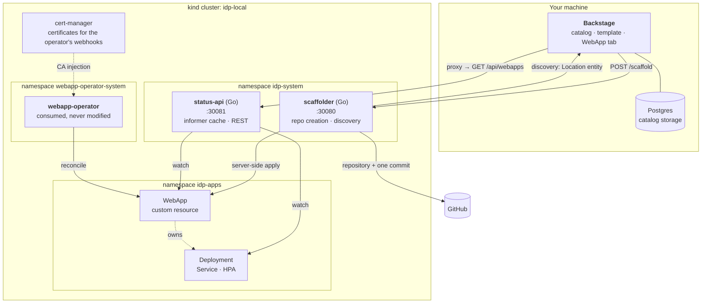

# Architecture



## The design rule

Backstage core is TypeScript and that cannot be avoided. Everything else is Go:
if a piece of logic can live in a Go service, it lives in a Go service, and the
TypeScript side is only ever an HTTP client to it.

The rule is not decoration. It is why the scaffolder's validation, ordering,
idempotency and failure handling are testable with `go test`, and why the only
TypeScript in the provisioning path is about seventy lines that build a request
and turn status codes into readable messages.

## The components

### scaffolder — Go

Owns everything the platform does against GitHub.

**`POST /scaffold`** creates the repository from an embedded template
(`go:embed`, so the binary carries its own content and needs no network for that
step) and applies the `WebApp` custom resource, in that order. Both steps are
idempotent.

**`GET /catalog/discovery`** lists the account's repositories, keeps the ones
carrying a `catalog-info.yaml`, and returns them as a Backstage `Location`
entity. It exists because Backstage's own GitHub discovery only works for
organizations — see
[the decision](decisions.md#github-discovery-does-not-work-for-personal-accounts).

It runs inside the cluster because applying a custom resource needs cluster
credentials. Its GitHub token arrives through a Secret created from an
environment variable and piped into `kubectl`, never through a file.

### status-api — Go

Reads `WebApp` custom resources through the **dynamic client** and the
Deployments the operator creates through the typed one, both behind shared
informers, and serves them over REST:

```
GET /api/webapps                    every custom resource, summarised
GET /api/webapps/{namespace}/{name} one, with its Available condition
GET /healthz /readyz /metrics
```

Reads never touch the API server — they are answered from an in-memory cache kept
current by a watch. Readiness is tied to cache sync, because serving an empty
list from a cold cache would read as "there are no WebApps", which is a very
different answer from "not ready yet".

### webapp-status — TypeScript

Adds the **WebApp** tab to entities carrying the
`platform.miportfolio.com/webapp` annotation. It reads the status API through
the Backstage proxy and polls every five seconds.

### The custom action

`platform:scaffoldWebApp` is a transport layer: build a request, send it, turn
each status code into something a person can act on. It holds no business logic.

## Working with the operator

The operator is consumed, never modified. Three of its behaviours shape the
platform around it:

- **Its children are named with a suffix** — `<name>-deployment`, `-service`,
  `-autoscaler`. The status API does not rely on that: it matches on the owner
  reference, which is the real contract and survives a rename.
- **Its validating webhook rejects `:latest`** and implicit tags. The scaffolder
  enforces the same rule before creating anything, so a request that admission
  would refuse never leaves a repository behind with no workload.
- **With autoscaling enabled it stops managing replicas.** That is why the API
  reports `desired`, `effective` and `ready` separately.

It also has two gaps that this repository works around without touching it: its
install manifest needs cert-manager and does not say so, and its ClusterRole has
no rule for `events`. Both are covered in
[design decisions](decisions.md#things-found-in-the-operator-while-consuming-it).
