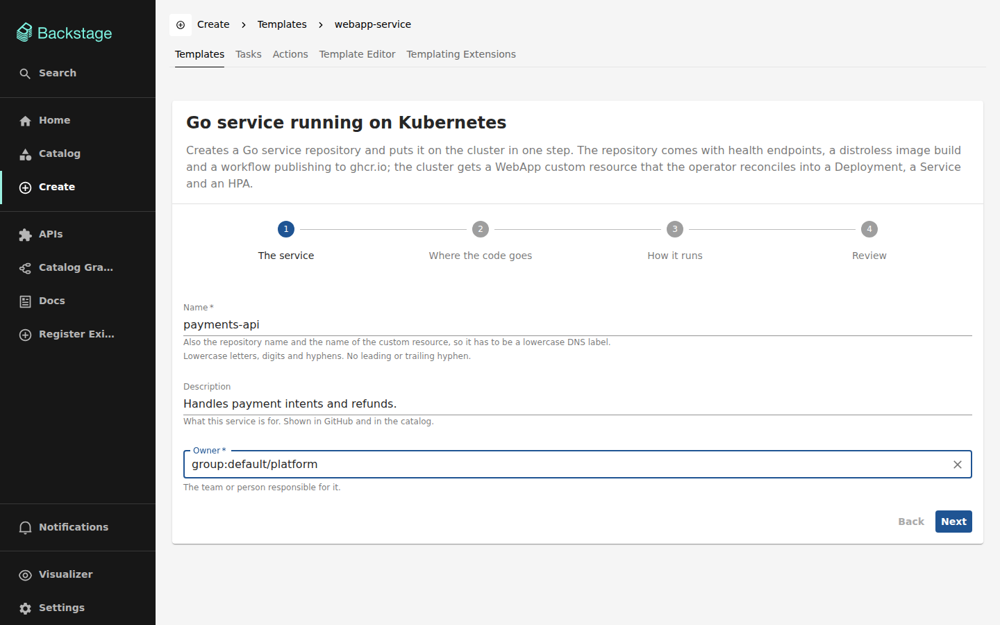

# Creating a service

Open **Create** in the sidebar and pick *Go service running on Kubernetes*.



## The form

| Field | What it is |
|-------|-----------|
| **Name** | The repository name, the service name and the name of the custom resource. It has to be a lowercase DNS label, because Kubernetes objects are named after it. |
| **Description** | One line. Shown in GitHub and in the catalog. |
| **Owner** | The team or person responsible. Comes from the catalog, so it has to exist. |
| **Repository** | Where the code goes. |
| **Container image** | What the cluster will run. |
| **Port** | The port the service listens on. Defaults to 8080. |
| **Replicas** | How many pods. Defaults to 2. |

### About the image

The image needs an **explicit tag that is not `latest`**. This is not a style
preference: the operator's admission webhook rejects `:latest` and untagged
references outright, so an image you cannot pin is one the cluster will not run.
A digest (`@sha256:…`) works too.

The form checks this while you type, and the scaffolder checks it again before
creating anything — a form is not a security boundary, and the API is callable
directly.

Your service has not published an image of its own yet at the moment it is
created, so the default is a pinned public placeholder. Point it at your own
image after the first CI run; see [changing what runs](#changing-what-runs).

## What lands in your repository

```
main.go              a Go service with /healthz, /readyz and /metrics
metrics.go           Prometheus exposition format, standard library only
main_test.go
go.mod               no dependencies at all
Dockerfile           multi-stage, distroless, non-root
Makefile             run · test · lint · build · image · deploy
webapp.yaml          the custom resource that runs it
catalog-info.yaml    its entry in the catalog
mkdocs.yml + docs/   its own documentation
.github/workflows/   builds and publishes to ghcr.io on every push
```

The service has **no third-party dependencies**. The metrics endpoint writes
Prometheus exposition format by hand, which is about sixty lines for a counter
and a duration total — cheaper than a dependency, a `go.sum` to keep in sync and
a supply chain to audit. Reach for `prometheus/client_golang` the day the metrics
stop being trivial.

## Watching it run

The new component has a **WebApp** tab:


It is the cluster, not a copy of what you typed. Scale the custom resource from
a terminal and the page follows within a few seconds:

```bash
kubectl -n idp-apps scale webapp <name> --replicas=4
```

### Why there are two replica numbers

When autoscaling is enabled the operator **stops managing the Deployment's
replica count** and hands it to the HorizontalPodAutoscaler. From then on, what
you asked for and what is running are two different numbers and both are
correct. The tab shows both rather than picking one and being wrong half the
time.

The same applies to the image during a rollout: you see what is running and what
it is rolling out to.

## Changing what runs

`webapp.yaml` in your repository is the desired state, and it lives with the code
so it changes through a pull request:

```yaml
apiVersion: platform.miportfolio.com/v1
kind: WebApp
metadata:
  name: payments-api
  namespace: idp-apps
spec:
  image: ghcr.io/you/payments-api:1.4.0
  replicas: 2
  port: 8080
```

Pushing to the default branch publishes `ghcr.io/<owner>/<name>:<sha>`. Point
`spec.image` at that tag and apply it:

```bash
make deploy
```

### Autoscaling

Add an `autoscaling` block and the operator creates an HPA instead of managing
replicas itself:

```yaml
spec:
  autoscaling:
    minReplicas: 2
    maxReplicas: 10
    cpuThresholdPercent: 70
```

A local kind cluster has no `metrics-server`, so the HPA will report
`cpu: <unknown>` until you install one.

## Creating the same service twice

Nothing breaks. Every step is idempotent: an existing repository is not
recreated, content is only pushed into a repository that has no commits of its
own, and the custom resource is applied server-side. Re-submitting the same form
is a no-op, which is also how a half-finished run is finished — see
[troubleshooting](troubleshooting.md#the-repository-exists-but-nothing-is-running).
