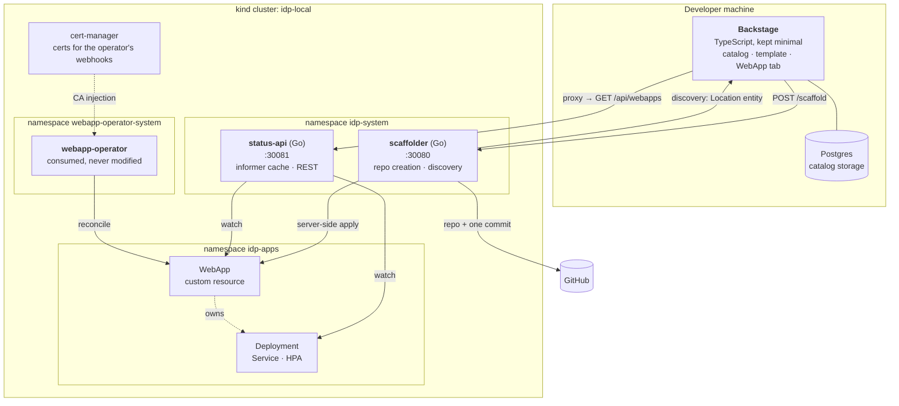

# How it works

## The components

### `services/scaffolder` — Go

Owns everything the platform does against GitHub.

- `POST /scaffold` creates the repository from an embedded template and applies
  the `WebApp` custom resource, in that order, idempotently.
- `GET /catalog/discovery` lists the repositories of the account that carry a
  catalog file and returns them as a Backstage `Location` entity. It exists
  because Backstage's own GitHub discovery only works for organizations; see
  [Decisions](decisions.md#github-discovery-does-not-work-for-personal-accounts).

It runs in the cluster because it needs cluster credentials to apply the custom
resource, and its GitHub token arrives through a Secret created from an
environment variable — never from a file.

### `services/status-api` — Go

Reads `WebApp` custom resources through the **dynamic client** and the
Deployments the operator creates through the typed one, both behind shared
informers, and serves them over REST. Reads never touch the API server: they are
answered from an in-memory cache kept current by a watch.

Its readiness probe is tied to cache sync, because serving an empty list from a
cold cache would read as "there are no WebApps" — a different and much more
misleading answer than "not ready yet".

### `backstage/plugins/webapp-status` — TypeScript

Adds a **WebApp** tab to entities carrying the
`platform.miportfolio.com/webapp` annotation, showing the Available condition,
replicas, the deployed image and the autoscaling window. It reads the status API
through the Backstage proxy and polls every five seconds.

### The custom action

`platform:scaffoldWebApp` is the only TypeScript in the provisioning path and it
is a transport layer: build a request, send it, turn each status code into
something readable. Every decision lives in Go.

## What the operator does, and what it refuses

The operator is consumed, never modified. Two of its behaviours shape this
platform:

- It names the objects it owns with a suffix — `<webapp>-deployment`,
  `-service`, `-autoscaler` — so anything resolving a custom resource to its
  workload has to know that. The status API does not rely on it: it matches on
  the owner reference, which is the real contract.
- Its validating webhook **rejects `:latest` and implicit tags**. The scaffolder
  enforces the same rule before creating anything, so a request that admission
  would refuse never leaves a repository behind with no workload.

When autoscaling is enabled the operator stops managing the Deployment's replica
count and lets the HPA own it. That is why the status API reports `desired`,
`effective` and `ready` separately: during autoscaling they are three different
numbers and collapsing them would misrepresent the cluster.
