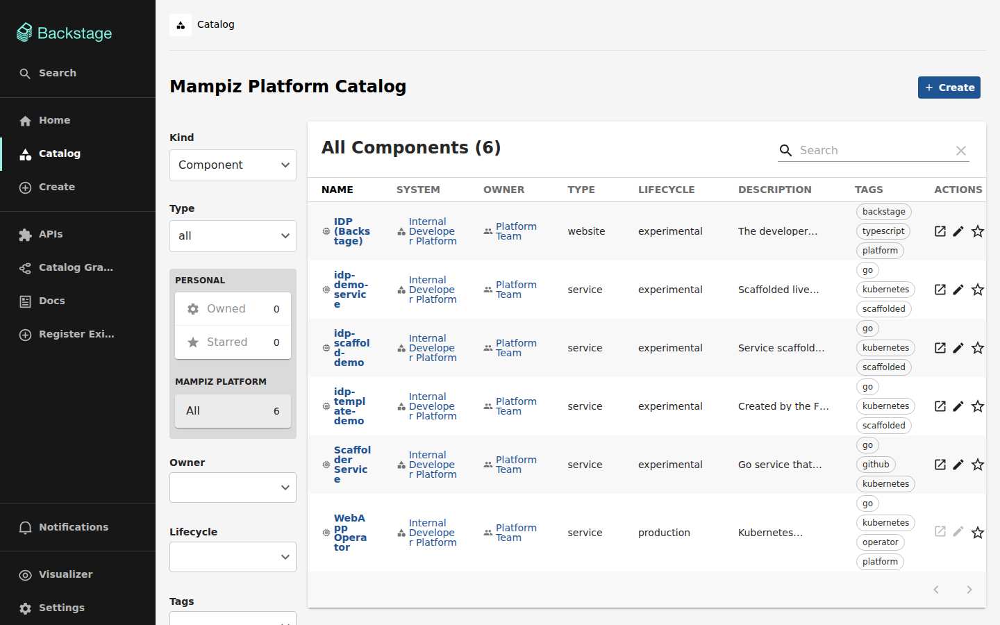
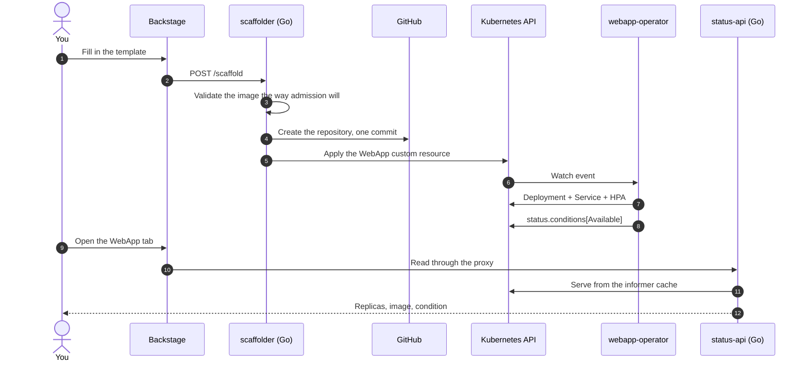
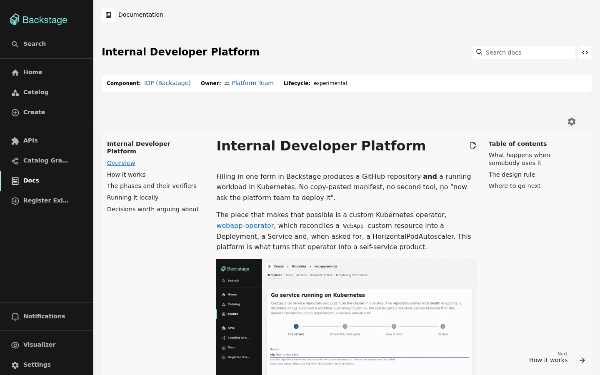

# Internal Developer Platform

Create a service from a form and it is running in Kubernetes before you have
finished reading the confirmation page. One step produces a GitHub repository
with CI, a container build and health endpoints, **and** a workload on the
cluster — no manifest to copy, no second tool, no ticket to the platform team.

## The whole flow

Everything in that recording is real: a GitHub repository is created, a custom
resource is applied, pods start, and the last few seconds are somebody running
`kubectl scale` outside Backstage while the page follows along.

## What you get

Filling in the **Go service running on Kubernetes** template produces:

- **A repository** containing a Go service with `/healthz`, `/readyz` and
  `/metrics`, a distroless container build, a Makefile, a GitHub Actions
  workflow that publishes to ghcr.io, its own documentation, and the
  `webapp.yaml` that describes how it runs.
- **A running workload**: a `WebApp` custom resource that
  [webapp-operator](https://github.com/Mampiz/webapp-operator) reconciles into a
  Deployment, a Service and, if you ask for it, a HorizontalPodAutoscaler.
- **A catalog entry** with a **WebApp** tab showing the live state of the
  cluster: the Available condition, ready and desired replicas, and the image
  actually running.

## How it fits together

## The documentation lives in the portal

These pages are served as TechDocs inside Backstage, next to the components they
describe:

## Where to go next

- **[Getting started](getting-started.md)** — run the whole platform on your
  machine in about five minutes.
- **[Creating a service](creating-a-service.md)** — the form, what lands in your
  repository, and how to change what runs.
- **[Architecture](architecture.md)** — the components and why each one exists.
- **[Troubleshooting](troubleshooting.md)** — the failures you are most likely to
  hit, and what they actually mean.
- **[Design decisions](decisions.md)** — the choices that were not obvious.
- **[Contributing](contributing.md)** — repository layout, tests, and how to run
  them.
