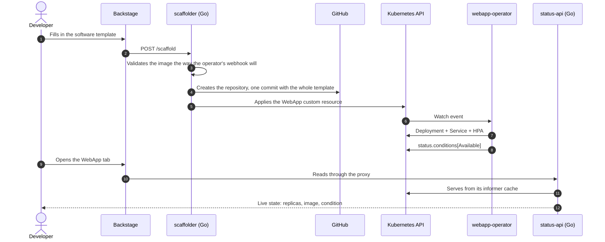

# Internal Developer Platform

Filling in one form in Backstage produces a GitHub repository **and** a running
workload in Kubernetes. No copy-pasted manifest, no second tool, no "now ask the
platform team to deploy it".

The piece that makes that possible is a custom Kubernetes operator,
[webapp-operator](https://github.com/Mampiz/webapp-operator), which reconciles a
`WebApp` custom resource into a Deployment, a Service and, when asked for, a
HorizontalPodAutoscaler. This platform is what turns that operator into a
self-service product.

## What happens when somebody uses it

## The design rule

Backstage core is TypeScript and that cannot be avoided. Everything else is Go:
if a piece of logic can live in a Go service, it lives in a Go service, and the
TypeScript side is only ever an HTTP client to it.

That rule is not decoration. It is why the scaffolder's validation, ordering,
idempotency and failure policy are all testable with `go test`, and why the only
TypeScript in the provisioning path is seventy lines that build a request and map
status codes to messages.

## Where to go next

- [How it works](how-it-works.md) — the components and why each one exists.
- [The phases and their verifiers](verifiers.md) — how every claim on this page
  is checked by a command that exits non-zero when it is not true.
- [Running it locally](running-locally.md).
- [Decisions worth arguing about](decisions.md) — the choices that were not
  obvious, with the reasoning and the trade-off.
